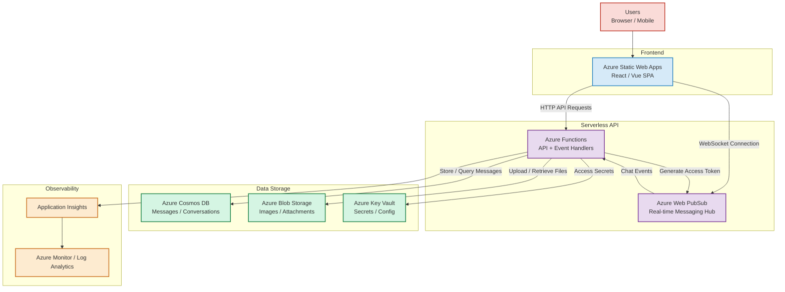

# CST8912-LiveChatApplication
# Azure Serverless Live Chat — Architecture Diagram

```mermaid
flowchart TB

%% Users
U[Users<br/>Browser / Mobile]

%% Frontend Layer
subgraph Frontend
SWA[Azure Static Web Apps<br/>React / Vue SPA]
end

%% Serverless Backend
subgraph Serverless API
FUNC[Azure Functions<br/>API + Event Handlers]
WPS[Azure Web PubSub<br/>Real-time Messaging Hub]
end

%% Data Layer
subgraph Data Storage
COSMOS[Azure Cosmos DB<br/>Messages / Conversations]
BLOB[Azure Blob Storage<br/>Images / Attachments]
KV[Azure Key Vault<br/>Secrets / Config]
end

%% Monitoring
subgraph Observability
APP[Application Insights]
MON[Azure Monitor / Log Analytics]
end

%% Connections
U --> SWA

SWA -->|HTTP API Requests| FUNC
SWA -->|WebSocket Connection| WPS

FUNC -->|Generate Access Token| WPS
FUNC -->|Store / Query Messages| COSMOS
FUNC -->|Upload / Retrieve Files| BLOB
FUNC -->|Access Secrets| KV

WPS -->|Chat Events| FUNC

FUNC --> APP
APP --> MON

%% Styling
classDef frontend fill:#D6EAF8,stroke:#2E86C1,stroke-width:2px
classDef backend fill:#E8DAEF,stroke:#7D3C98,stroke-width:2px
classDef data fill:#D5F5E3,stroke:#1E8449,stroke-width:2px
classDef monitor fill:#FDEBD0,stroke:#CA6F1E,stroke-width:2px
classDef user fill:#FADBD8,stroke:#C0392B,stroke-width:2px

class U user
class SWA frontend
class FUNC,WPS backend
class COSMOS,BLOB,KV data
class APP,MON monitor
```
